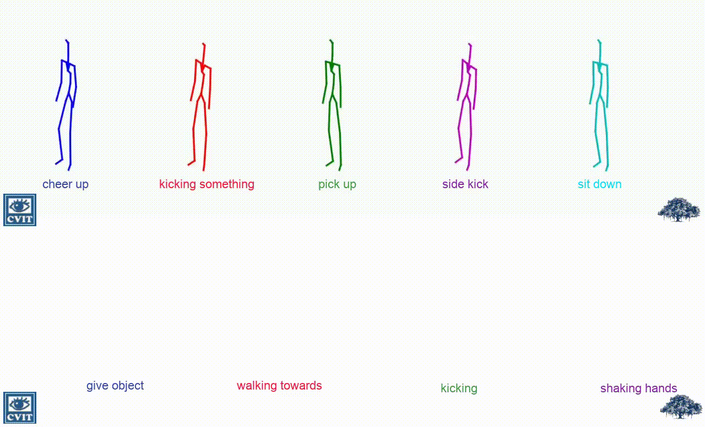
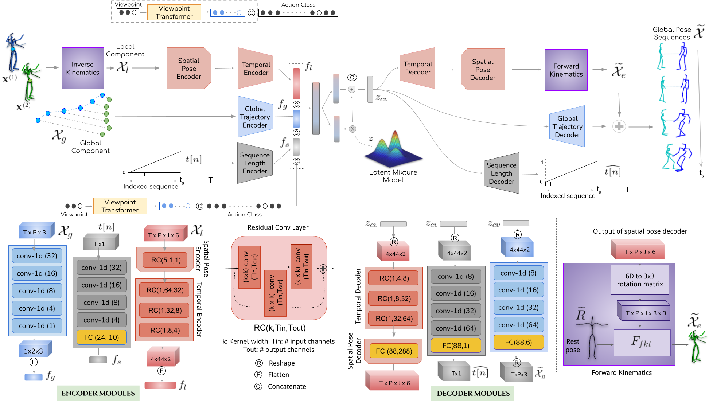
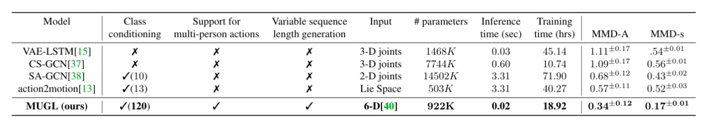

# MUGL
The official pytorch implementation of [**MUGL: Large Scale Multi Person Conditional Action Generation with Locomotion**](https://arxiv.org/abs/2110.11460), [WACV 2022](https://wacv2022.thecvf.com/home).
Please visit our [**webpage**](https://skeleton.iiit.ac.in/mugl) for more details.



## Table of contents:
1. Description
1. How to use

## Description
We introduce MUGL, a novel deep neural model for large-scale, diverse generation of single and multi-person pose-based action sequences with locomotion. Our controllable approach enables variable-length generations customizable by action category, across more than 100 categories. To enable intra/inter-category diversity, we model the latent generative space using a Conditional Gaussian Mixture Variational Autoencoder. To enable realistic generation of actions involving locomotion, we decouple local pose and global trajectory components of the action sequence. We incorporate duration-aware feature representations to enable variable-length sequence generation. We use a hybrid pose sequence representation with 3D pose sequences sourced from videos and 3D Kinect-based sequences of NTU-RGBD-120. To enable principled comparison of generation quality, we employ suitably modified strong baselines during evaluation. Although smaller and simpler compared to baselines, MUGL provides better quality generations, paving the way for practical and controllable large-scale human action generation. 



### Quantitative comparison


## How to use
#### Requirements
```
$ pip install -r requirements.txt 
```

#### Data Preprocessing 
We use `NTU-VIBE` dataset for all our experiments. To extract NTU-VIBE dataset, [VIBE](https://github.com/mkocabas/VIBE) pose estimation used on the entire `NTU RGBD-120` dataset. But [VIBE](https://github.com/mkocabas/VIBE) extracts only the local pose of the sequence i.e. human pose with respect to the root joint. For Extracting position of human pose at the global trajectory we use NTU-120 kinect dataset. The whole process of data preprocessing is performed in 7 steps.

**Step 1:**
Extract `NTU RGBD-120` skeleton using [VIBE](https://github.com/mkocabas/VIBE) pose estimation, and place it in `./dataset/NTU-VIBE` directory. Then run the following,
```
$ mkdir -p dataset/NTU-VIBE/
$ cd data_preprocessing/
$ python rotation.py 
```
 **Step 2**
 Run the following for creating data for 2-person interaction classes.
 ```
$ python make_dataset2persons.py 
```

**step 3**
In the step we extract skeleton data from `NTU-120` kinect dataset. Download NTU-120 kinect data and place the `skeleton` files in `./dataset/nturgbd_skeletons_s001_to_s017` directory and run the following,
```
$ python txt2npy.py
```

**Step 4**
In this step we extract the root trajectory from the NTU Kinect dataset and map with `NTU-VIBE` dataset.
 ```
$ python map_root.py
```

**Step 5**
 ```
$ python preprocessing2person.py
```

**Step 6**
```
$ python get_seq_len.py
```


**Step 7**
 ```
$ python make_subset_2_person.py
```


### Training
**You can skip this step if you want to use our pretrained model.**
To train MUGL from scratch run `pose.py`. Details of MUGL model can be found in `model/`. For training MUGL run the following,
 ```
$ python pose.py
```


### Visualization
If you want to play with pretrained MUGL model please see `visualization.ipynb`. Further, if you want to generate [SMPL-X](https://github.com/vchoutas/smplx) mesh from the skeleton please refer to `visualize_mesh.ipynb`.


### Evaluation
Implementation of evaluation metrics can be found in the `metrics` directory.


#### Bibtex
Please cite our paper if you end up using it for your own research:
```
@InProceedings{MUGL,
title = {MUGL: Large Scale Multi Person Conditional Action Generation with Locomotion },
author = {Debtanu Gupta, Shubh Maheshwari, Ravi Kiran Sarvadevabhatla},
booktitle = {WACV},
year = {2022},
}
```
